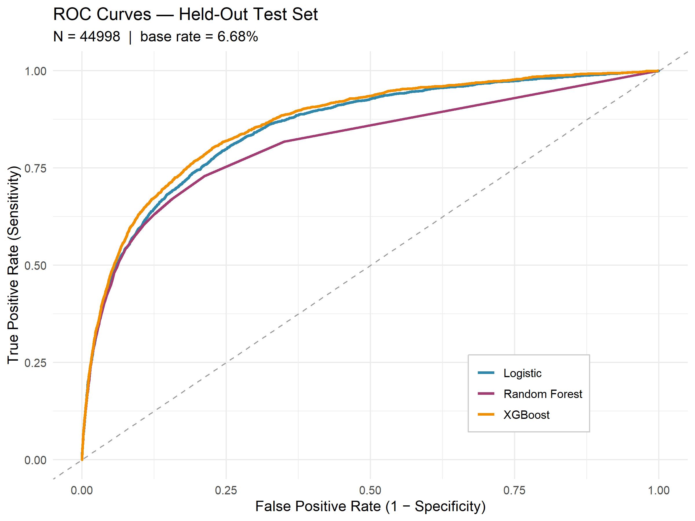
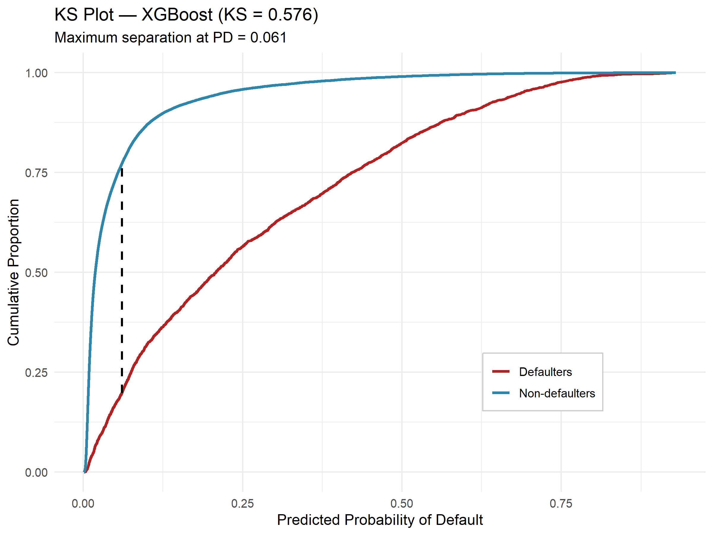

# Credit Risk Analytics — End-to-End Scorecard Pipeline

End-to-end credit risk scorecard on the *Give Me Some Credit* dataset (150k borrowers). Covers cleaning → feature engineering → SQL KPIs → 3-model training → credit-standard evaluation → external scoring → interactive Shiny dashboard.

**Best model: XGBoost — AUC 0.864 · Gini 0.729 · KS 0.576**


---

## Results

| Model | AUC | Gini | KS | F1 |
|---|---|---|---|---|
| Logistic (glmnet) | 0.8535 | 0.7070 | 0.5509 | 0.3060 |
| Random Forest | 0.8134 | 0.6267 | 0.5163 | 0.3103 |
| **XGBoost** | **0.8644** | **0.7287** | **0.5758** | **0.3231** |

Evaluated on a 44,998-row held-out split. XGBoost wins on 6/8 metrics; logistic is nearly as strong, confirming that **feature engineering drives discrimination, not model complexity**. Production scoring: 101,503 external applicants, mean PD 5.58% — no distributional drift vs. the 6.68% training base rate.




---

## Pipeline
cs-training.csv
→ 01_data_cleaning.R → cleaned_data
→ 02_EDA.R → plots/01–10
→ 03_build_features_and_kpis.R → modeling_data, business_kpis
→ 04_model_training.R → trained_models, test_data, feature_schema
→ 05_model_evaluation.R → model_metrics_internal
→ 06_predictions.R → scored_loans
→ 07_visualisation.R → plots/11–20
→ shiny/ → interactive dashboard


Tuned models on a 70/30 split for evaluation; full-refit models on all 150k for production.

---

## Feature Engineering

Seven engineered features from the raw columns. The strongest by far is **`total_late_events`** (sum of 30-59, 60-89, 90+ day late payments):

| `total_late_events` | N | Default Rate |
|---|---|---|
| 0 | 119,906 | 2.84% |
| 1 | 17,242 | 12.2% |
| 2 | 5,942 | 24.1% |
| 3 | 2,884 | 35.0% |
| 4–5 | 2,535 | 45.7% |
| 6+ | 1,490 | 61.2% |

A **21× spread** across buckets — the single dominant risk signal. Also engineered: `is_young`, `has_90plus_late`, `high_utilization`, `high_debt_ratio`, `income_per_person`, `lines_per_income`.

---

## Dashboard

Five-tab Shiny app: Portfolio Overview, Risk Analysis, Segment Explorer, Credit Scoring, Model Performance.


Example — high income + 3 sub-severe late events → **Very High Risk (15.6% PD)**. The model correctly weights delinquency chronicity over income, matching the "voluntary delinquency" pattern in consumer credit.

Live: **[LIVE-DEMO-URL]**

---

## Repo Structure
R/ 7 numbered pipeline scripts
shiny/ global.R + ui.R + server.R
data/ cs-training.csv, cs-test.csv (raw inputs)
outputs/ business_kpis.csv, metrics, plots/ (20 PNGs)
docs/ README assets

Large artifacts (`trained_models.rds`, `scored_loans.rds`, `test_data.rds`, `cleaned_data.*`) are **gitignored** — binary, large, fully regenerable. Raw inputs + all R scripts are committed for reproducibility.

---

## Run It

```r
install.packages(c("dplyr","tidyr","ggplot2","scales","DBI","RSQLite",
                   "caret","randomForest","xgboost","glmnet","pROC",
                   "Ckmeans.1d.dp","shiny","DT"))

setwd("credit-risk-analytics")
for (f in list.files("R", pattern="\\.R$", full.names=TRUE)) source(f)
shiny::runApp("shiny", launch.browser = TRUE)
